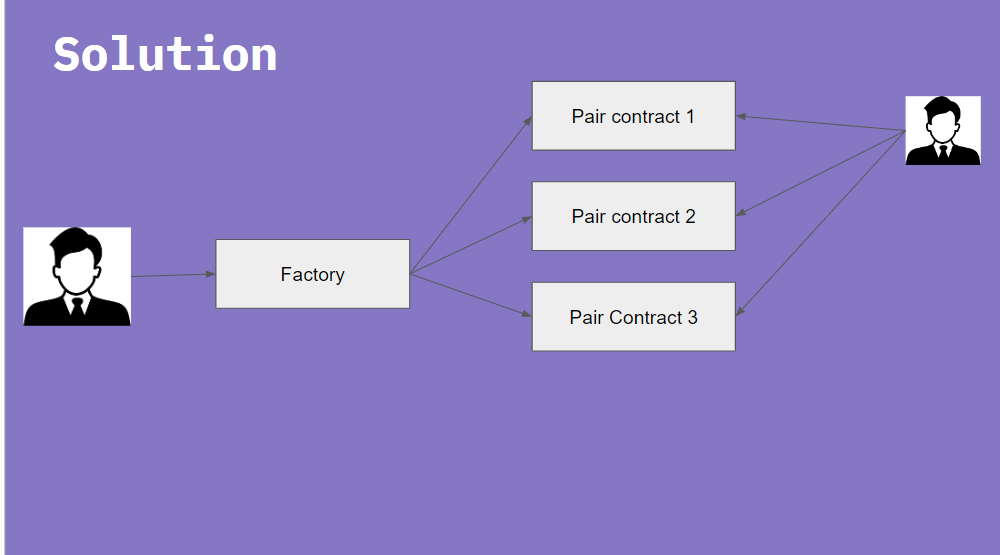

# PARALLEL AMM

## Problem Statement

Build an Automated Market Maker (AMM) that is optimized for parallel processing of individual token pair transactions. The AMM should process individual token pair transactions in parallel, be capital efficient, enable greater throughput than Uniswap, dynamically adjust trading fees based on network conditions, and manage liquidity pools in a scalable manner

## Implementation details



- A parallel AMM is currently being constructed using the Uniswap v2 code. The code is modified to align with our specific AMM requirements.
- The router contract of Uniswap v2 has been removed, and swapping features are now directly implemented into the pair contract.
- Users can now directly interact with the pair contract without the need for intermediate contracts.

## Documentation

## Usage

### Build

```shell
$ forge build
```

### Test

```shell
$ forge test
```

### Format

```shell
$ forge fmt
```

### Gas Snapshots

```shell
$ forge snapshot
```

### Anvil

```shell
$ anvil
```

### Deploy

```shell
$ forge script script/Counter.s.sol:CounterScript --rpc-url <your_rpc_url> --private-key <your_private_key>
```

### Cast

```shell
$ cast <subcommand>
```

### Help

```shell
$ forge --help
$ anvil --help
$ cast --help
```
